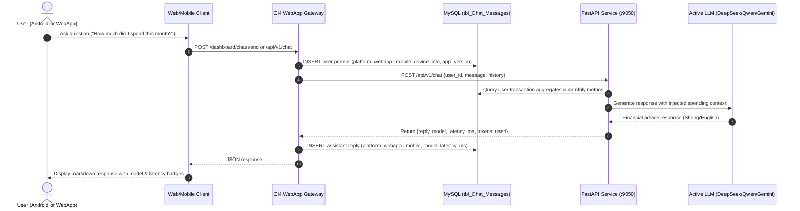
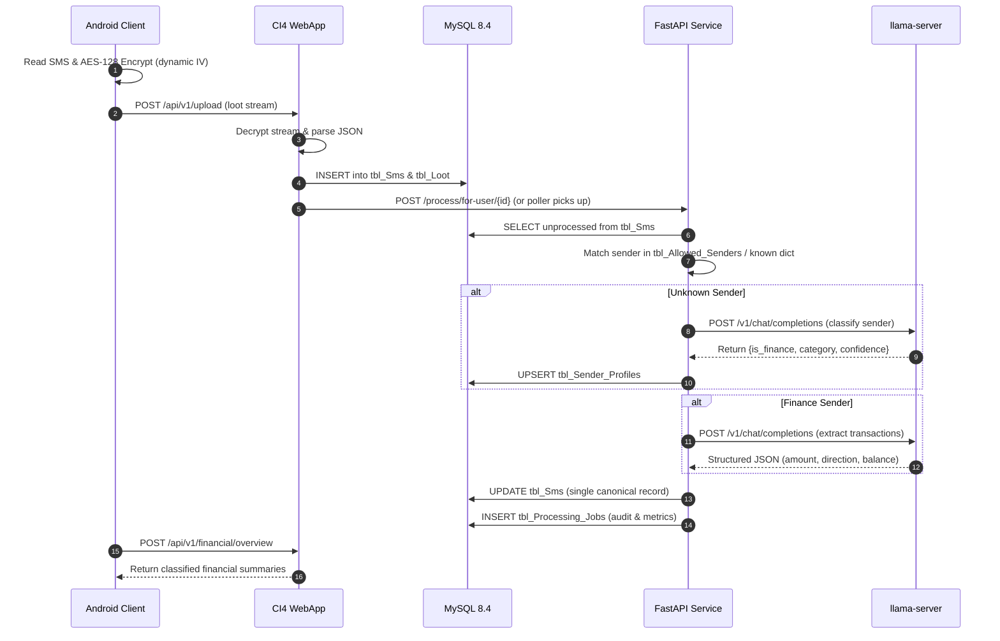

# Inter-Service Communication & Protocols

This document details transport protocols, sequences, and security contracts between the Android application, CodeIgniter 4 WebApp, and the FastAPI ML service.

---

## 1. Service Communication Matrix

| Source | Destination | Transport | Auth Mechanism | Dev URL | Purpose |
|--------|-------------|-----------|----------------|---------|---------|
| **Android App** | WebApp API | HTTP POST | Bearer SHA-256 Token | `http://10.0.2.2/api/v1/` | Payload upload, stats fetch, auth |
| **Android App** | WebApp Gateway | HTTP POST | Bearer / User Token | `http://10.0.2.2/api/v1/chat` | Conversational AI financial chat |
| **WebApp** | ML Service | HTTP POST | Internal network | `http://ml-mpesa-analyzer:9050/` | Trigger user job, rescan, health, chat |
| **WebApp** | Redis | TCP (6379) | Socket / Host | `redis:6379` | Session storage, cache, live telemetry |
| **WebApp** | MySQL | TCP (3306) | User/Password | `mysql:3306` | Web queries, Shield auth, inserts |
| **ML Service** | MySQL | TCP (3306) | User/Password | `mysql:3306` | Polling, canonical SMS updates, metrics |
| **FastAPI** | llama-server | HTTP POST | Localhost loopback | `http://localhost:8080/v1` | OpenAI-compatible completions |

---

## 2. Conversational AI Financial Assistant Flow



---

## 3. End-to-End Ingestion & Processing Flow



---

## 4. Security & Payload Protocol

### Dynamic IV AES-128-CBC
1. **Client Streaming**: The Android app generates a 16-byte cryptographically secure random IV (`SecureRandom`).
2. **IV Prefixing**: The IV is written as the first 16 bytes of the binary payload stream.
3. **Payload**: The remainder of the stream contains the AES-128-CBC encrypted JSON body.
4. **Server Decryption**: The CI4 WebApp reads the initial 16 bytes, sets it as the IV, and executes `openssl_decrypt()`.

---

## 5. API Error Body Convention

All JSON API endpoints conform to a standardized error envelope:

```json
{
  "status": "error",
  "message": "Human-readable description of error",
  "code": 400,
  "errors": {
    "field_name": ["Specific validation error"]
  }
}
```
