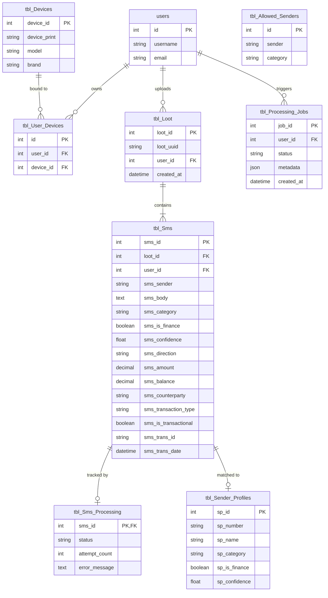
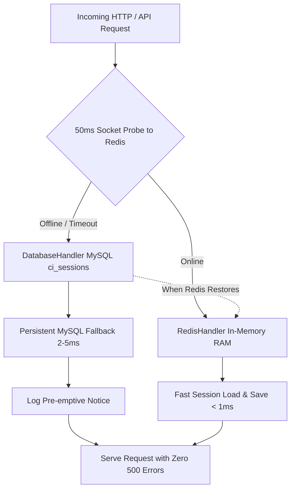

# Data Architecture & Storage Design

The system relies on a single shared MySQL 8.4 database (`db_mpesa_analyzer`). This document describes the database design principles, canonical record structure, relational entity mappings, and analytical views.

---

## 1. Entity-Relationship Diagram (ERD)

The diagram below illustrates relationships between device registration, uploaded payload batches, canonical SMS storage, and background ML processing jobs:



---

## 2. Single Canonical Record (`tbl_Sms`)

To avoid duplicate writes and synchronization drift between classification and extraction, all attributes for an individual SMS message live on a **single canonical row** in `tbl_Sms`.

```
┌────────────────────────────────────────────────────────────────────────┐
│                        tbl_Sms (Canonical Record)                       │
├────────────────────────────────────────────────────────────────────────┤
│ • Ingestion Metadata:   sms_id, user_id, loot_id, sender, raw_body     │
│ • Classification:       sms_category, sms_is_finance, sms_confidence   │
│ • Extraction Fields:    sms_direction, sms_amount, sms_balance,        │
│                         sms_counterparty, sms_transaction_type,        │
│                         sms_is_transactional, sms_trans_id,            │
│                         sms_trans_date                                 │
└───────────────────────────────────┬────────────────────────────────────┘
                                    │
            ┌───────────────────────┴───────────────────────┐
            ▼                                               ▼
┌───────────────────────────────┐               ┌───────────────────────────────┐
│  VIEW tbl_Sms_Classification  │               │ VIEW tbl_Analyzed_Transactions│
│  (Derived classification map) │               │ (Derived transactional subset)│
└───────────────────────────────┘               └───────────────────────────────┘
```

The database views `tbl_Sms_Classification` and `tbl_Analyzed_Transactions` are **read-only projections** over `tbl_Sms`. The ML service writes once to `tbl_Sms`, and the web application queries the views for reporting. For architectural rationale, see [ADR 0001: Single Canonical SMS Record](../adr/0001-single-canonical-sms-record.md).

---

## 3. Sender Profile & Allowlist Strategy

1. **`tbl_Allowed_Senders`**: Global database allowlist populated with verified Kenyan financial senders. Entries here bypass LLM classification entirely and receive immediate `0.95` confidence.
2. **`tbl_Sender_Profiles`**: Cached sender catalog generated dynamically by the classifier. Once an unknown sender is evaluated by the LLM, the result is saved here to prevent subsequent LLM calls.
3. **`tbl_Blocked_Senders`**: Per-user exclusions for marketing or non-relevant sender numbers.

---

## 4. Job Execution & Audit Tracking

- **`tbl_Processing_Jobs`**: Every batch run or user-triggered rescan inserts a job row. The `metadata` column stores a detailed JSON document detailing:
  - Total SMS processed, financial count, skipped count
  - Category and direction distribution
  - Model path, LLM context size, temperature, and batch configuration
  - Execution duration in seconds and error logs
- **`tbl_ML_Controls`**: Contains persistent system toggles, notably `auto_jobs_enabled`, which allows operators to pause background processing.
- **`tbl_LLM_Prompts`**: Stores versioned prompt templates. Edits made in the admin UI create new versions rather than overwriting historical prompts.

---

## 5. Persistent Chat Dialogues (`tbl_Chat_Messages`)

Multi-turn conversations between authenticated users and the AI Financial Assistant are stored in `tbl_Chat_Messages` (migration `2026-09-25-000031_CreateTblChatMessages.php`).

```
┌────────────────────────────────────────────────────────────────────────┐
│                      tbl_Chat_Messages                                 │
├────────────────────────────────────────────────────────────────────────┤
│ • Identity & Turn:      id (PK), user_id (indexed), role (user|assistant)│
│ • Content:              message (TEXT)                                 │
│ • Client Provenance:    platform ('webapp' | 'mobile', indexed),        │
│                         device_info (UA or phone model),               │
│                         app_version (e.g. '3.5.0')                     │
│ • AI Observability:     model, provider, tokens_used, latency_ms       │
│ • Timestamp:            created_at (indexed with user_id)               │
└────────────────────────────────────────────────────────────────────────┘
```

### Key Capabilities:
1. **Platform Segregation**: The `platform` column discriminates between questions typed into the WebApp browser and those submitted via the Android companion app, allowing unified storage with per-device telemetry.
2. **Context Windowing**: On chat initialization, the WebApp and Mobile endpoints fetch the user's latest 50 dialogue turns to populate the multi-turn prompt history.
3. **Auditability**: Latency (`latency_ms`) and token consumption (`tokens_used`) are recorded for each AI response, supporting system performance audits.

---

## 6. Redis 7 In-Memory Caching & Session Storage

The `mpesa-redis` container provides high-throughput, low-latency caching and temporary storage:

| Attribute | Specification | Purpose |
|---|---|---|
| **Engine** | Redis 7 Alpine (`redis:7-alpine`) | Ephemeral storage & cache acceleration |
| **Published Port** | `6379` | Host and inter-container connectivity |
| **Memory Limit** | `128 MB` (`--maxmemory 128mb`) | Strict RAM cap preventing container OOM |
| **Eviction Policy** | `volatile-lru` (`--maxmemory-policy volatile-lru`) | Automatically evicts oldest expired keys |
| **Session Key Pattern** | `ci_session:*` | Distributed WebApp user sessions |
| **Prompt Cache Pattern** | `mpesa:chat:cache:*` | Caches repetitive financial aggregate queries |
| **Live Telemetry** | Polled via Redis `INFO` / Socket | Powers the 4th KPI card on `admin/telemetry` |

---

## 7. Dual-Engine Resilience & High-Availability Failover

To eliminate single-point-of-failure vulnerabilities, the platform implements a **self-healing, zero-downtime dual-engine failover mechanism** for user sessions and application cache:



### Storage Driver Fallback Matrix

| Layer | Primary In-Memory Driver | Fallback Durable Driver | Failover Trigger | Recovery Behavior |
|---|---|---|---|---|
| **Web Sessions** | `RedisHandler` (`tcp://redis:6379`) | `DatabaseHandler` (`ci_sessions` table) | Redis socket probe $> 50\text{ ms}$ or connection refused | Instant switch back to Redis on next probe |
| **Application Cache** | `RedisHandler` (RAM keyspace) | `FileHandler` (`WRITEPATH . 'cache/'`) | Redis unreachable during initialization | Automatically re-engages Redis when online |
| **Financial SMS & Ledger** | **Always MySQL** | **Always MySQL** | Not applicable | ACID durability across all transactions |
| **Conversational AI History**| **Always MySQL** | **Always MySQL** | Not applicable | Permanent audit log in `tbl_Chat_Messages` |

### Architectural Guarantees
1. **Zero User Disruption**: When Redis restarts or crashes, the platform transparently persists session tokens in MySQL table `ci_sessions`. Users remain authenticated without 500 errors.
2. **Ultra-Low Probe Overhead**: The socket probe uses a strict 50ms timeout (`@fsockopen()`) with static request-level memoization, ensuring subsequent calls in the same request take $0\text{ ms}$.
3. **Automated Session Pruning**: CodeIgniter CLI command `php spark session:gc` automatically deletes expired records from `ci_sessions` (`timestamp < UNIX_TIMESTAMP() - expiration`), preventing MySQL table bloat.
4. **Live Observability**: Real-time status is exposed via the public `/health` endpoint (`redis_status: "connected" | "fallback_active"`), the SuperAdmin telemetry dashboard, and an automated alert badge on the SuperAdmin navbar.


