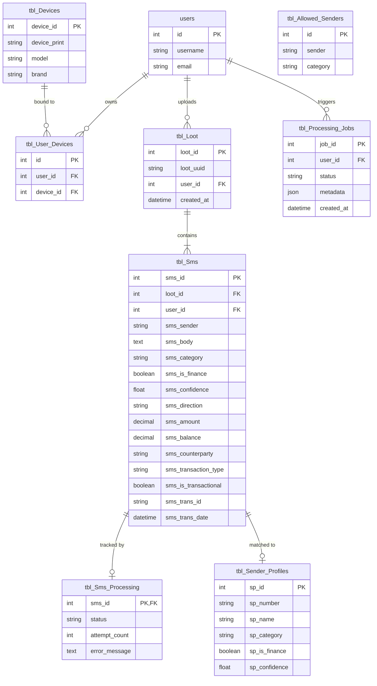

# Data Architecture & Storage Design

The system relies on a single shared MySQL 8.4 database (`db_mpesa_analyzer`). This document describes the database design principles, canonical record structure, relational entity mappings, and analytical views.

---

## 1. Entity-Relationship Diagram (ERD)

The diagram below illustrates relationships between device registration, uploaded payload batches, canonical SMS storage, and background ML processing jobs:



---

## 2. Single Canonical Record (`tbl_Sms`)

To avoid duplicate writes and synchronization drift between classification and extraction, all attributes for an individual SMS message live on a **single canonical row** in `tbl_Sms`.

```
┌────────────────────────────────────────────────────────────────────────┐
│                        tbl_Sms (Canonical Record)                       │
├────────────────────────────────────────────────────────────────────────┤
│ • Ingestion Metadata:   sms_id, user_id, loot_id, sender, raw_body     │
│ • Classification:       sms_category, sms_is_finance, sms_confidence   │
│ • Extraction Fields:    sms_direction, sms_amount, sms_balance,        │
│                         sms_counterparty, sms_transaction_type,        │
│                         sms_is_transactional, sms_trans_id,            │
│                         sms_trans_date                                 │
└───────────────────────────────────┬────────────────────────────────────┘
                                    │
            ┌───────────────────────┴───────────────────────┐
            ▼                                               ▼
┌───────────────────────────────┐               ┌───────────────────────────────┐
│  VIEW tbl_Sms_Classification  │               │ VIEW tbl_Analyzed_Transactions│
│  (Derived classification map) │               │ (Derived transactional subset)│
└───────────────────────────────┘               └───────────────────────────────┘
```

The database views `tbl_Sms_Classification` and `tbl_Analyzed_Transactions` are **read-only projections** over `tbl_Sms`. The ML service writes once to `tbl_Sms`, and the web application queries the views for reporting. For architectural rationale, see [ADR 0001: Single Canonical SMS Record](../adr/0001-single-canonical-sms-record.md).

---

## 3. Sender Profile & Allowlist Strategy

1. **`tbl_Allowed_Senders`**: Global database allowlist populated with verified Kenyan financial senders. Entries here bypass LLM classification entirely and receive immediate `0.95` confidence.
2. **`tbl_Sender_Profiles`**: Cached sender catalog generated dynamically by the classifier. Once an unknown sender is evaluated by the LLM, the result is saved here to prevent subsequent LLM calls.
3. **`tbl_Blocked_Senders`**: Per-user exclusions for marketing or non-relevant sender numbers.

---

## 4. Job Execution & Audit Tracking

- **`tbl_Processing_Jobs`**: Every batch run or user-triggered rescan inserts a job row. The `metadata` column stores a detailed JSON document detailing:
  - Total SMS processed, financial count, skipped count
  - Category and direction distribution
  - Model path, LLM context size, temperature, and batch configuration
  - Execution duration in seconds and error logs
- **`tbl_ML_Controls`**: Contains persistent system toggles, notably `auto_jobs_enabled`, which allows operators to pause background processing.
- **`tbl_LLM_Prompts`**: Stores versioned prompt templates. Edits made in the admin UI create new versions rather than overwriting historical prompts.
