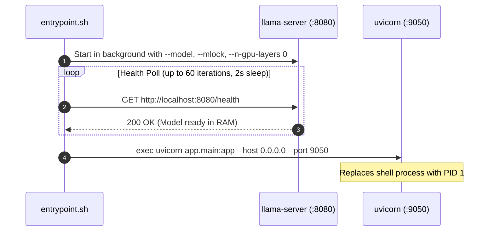

# Container Lifecycle & Deployment Architecture

This document details the multi-process orchestration, container entrypoint sequence, and inference hardware parameters for the **ML Mpesa Analyzer** container.

---

## 1. Container Structure

The image is built from `python:3.12-slim` and encapsulates two co-located background processes:

```
Dockerfile
├── System: curl, ca-certificates, libgomp1 (OpenMP support)
├── llama.cpp: pre-compiled llama-server binary + shared libraries (.so)
├── Models Volume: /models (mounted from host ./models)
├── Application: FastAPI codebase in /app
└── Orchestrator: entrypoint.sh
```

---

## 2. Process Startup Sequence (`entrypoint.sh`)



---

## 3. Hardware & Inference Optimization

- **CPU Pinning (`--mlock`)**: Locks model weight buffers in host physical RAM, preventing paging to swap files during memory pressure.
- **CPU Offloading (`--n-gpu-layers 0`)**: Pure CPU inference enabled by default using OpenMP thread allocation (`libgomp1`), guaranteeing compatibility on VPS and standard cloud compute instances without CUDA drivers.
- **Large Context (`--ctx-size 16384`)**: Provides ample token space for batching up to 20 SMS messages per prompt without truncating few-shot context or structured JSON output specifications.
