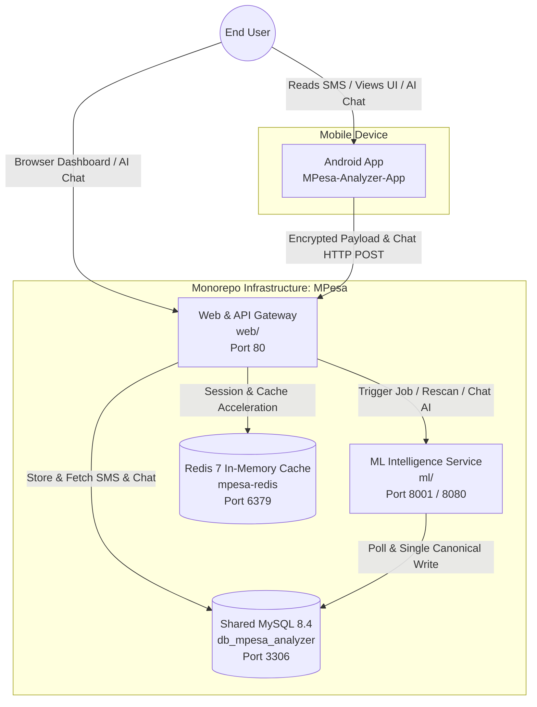

# System Architecture Overview

This document defines the C4 Context and Container boundaries for the **M-Pesa Analyzer Platform** monorepo.

---

## 1. High-Level Context

The platform automates the ingestion, client-side encryption, server-side persistence, and autonomous AI enrichment of mobile money SMS notifications from Kenyan financial institutions (M-PESA, banks, SACCOs, fintechs).

---

## 2. Container Responsibilities & Monorepo Paths

| Container / Component | Monorepo Subdirectory | Runtime & Stack | Ownership & Role |
|---|---|---|---|
| **Android App** | External (`Niccher/MPesa-Analyzer-App`) | Kotlin, Android SDK 36, Jetpack Compose, Retrofit | Captures local SMS, performs regex pre-classification, encrypts with dynamic IV AES-128-CBC, streams uploads, and hosts conversational AI chat screen. |
| **Web & API Gateway** | `web/` | PHP 8.3, Apache, CodeIgniter 4, Shield | Decrypts payloads, persists raw SMS in `tbl_Sms`, stores persistent chat dialogues in `tbl_Chat_Messages`, exposes dashboard & AI chat UI, and proxies mobile AI requests. |
| **ML Intelligence** | `ml/` | Python 3.12, FastAPI, llama-server, Qwen2.5 1.5B / DeepSeek / Gemini | Autonomous background polling, known-sender dictionary lookup, LLM classification, batch extraction, and conversational financial reasoning (`/api/v1/chat`). |
| **Redis Cache** | Root `docker-compose.yml` | Redis 7 Alpine | In-memory session persistence, query cache, prompt acceleration, and live telemetry tracking (128 MB maxmemory). |
| **Database** | Root `docker-compose.yml` | MySQL 8.4 (InnoDB) | Central persistence for raw SMS, classification profiles, transactions, chat logs (`tbl_Chat_Messages`), and audit jobs. |

---

## 3. Trust Boundaries & Authentication

1. **Android Client $\to$ WebApp API**:
   - Authenticated via SHA-256 Access Tokens (`auth_identities` table managed by Shield).
   - Payloads are encrypted client-side using dynamic IV AES-128-CBC; backend decrypts via `openssl_decrypt()`.
2. **Browser $\to$ WebApp Dashboard**:
   - Session-cookie authenticated via CodeIgniter Shield.
   - Global CSRF token verification enabled on all mutating POST requests.
3. **WebApp $\to$ ML Service**:
   - Internal Docker network communication on `http://ml-mpesa-analyzer:9050`.
   - Admin management protected by WebApp session role filtering (`admin` filter). Optional `X-Internal-Secret` header validation.
4. **ML Service $\to$ MySQL**:
   - Direct connection via asynchronous SQLAlchemy engine (`asyncmy`).
   - Gated by admin control flag (`tbl_ML_Controls.auto_jobs_enabled`).
