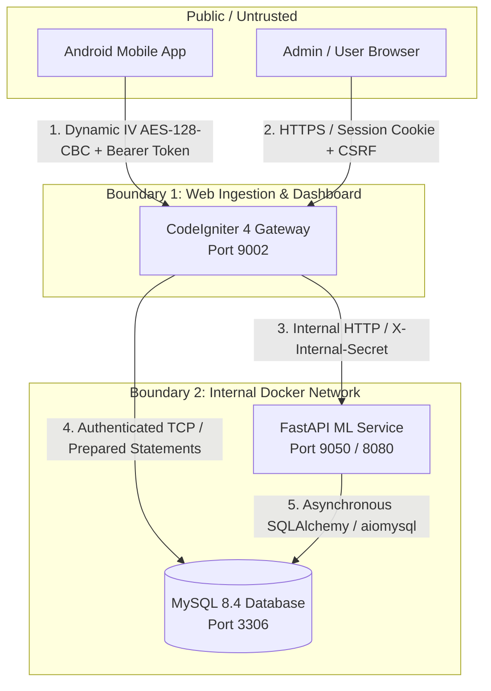

# Threat Model & Security Architecture

This document presents a comprehensive STRIDE threat model analysis for the **M-Pesa Analyzer Platform**, evaluating security risks across the Android mobile client, CodeIgniter 4 WebApp, FastAPI ML microservice, and MySQL 8.4 database.

---

## 1. System Attack Surfaces & Trust Boundaries

---

## 2. STRIDE Threat Matrix

| Threat Category | Potential Attack Vector | Impact | Mitigations in Codebase |
|---|---|---|---|
| **Spoofing** | Forged SMS upload payloads claiming to be from another user device | Attacker injects fraudulent transactions into victim account | • Access tokens hashed via SHA-256 (`auth_identities.secret`) • Device fingerprint binding (`tbl_Devices` / `tbl_User_Devices`) • Payloads bound to authenticated `user_id` on ingress |
| **Tampering** | Man-in-the-middle (MITM) tampering of encrypted SMS payloads on untrusted Wi-Fi | Payload payload manipulation, corruption of financial records | • Dynamic IV AES-128-CBC encryption on Android client (`CryptoHelper`) • Random 16-byte IV prefixed to stream; tampered ciphertext fails decryption • Strict TLS in production |
| **Repudiation** | User denies uploading SMS loot or modifying category categorization rules | Audit failure, unverified financial reporting | • Structured audit log (`tbl_Audit_Log`) records all uploads, token issues, and deletions • LLM inference logging in `tbl_LLM_Calls` with timestamps, latency, and model metadata |
| **Information Disclosure** | Exposure of raw SMS text containing sensitive financial balances and names | PII leakage, financial privacy violation | • Passwords hashed via Argon2id / bcrypt via CodeIgniter Shield • SMS payloads stored encrypted or base64-encoded with restricted database permissions • Debug toolbar disabled in production (`CI_ENVIRONMENT=production`) |
| **Denial of Service** | Exhaustion of local LLM inference queue via repeated batch trigger requests | High CPU utilization, server freeze, API unavailability | • Per-user asynchronous lock (`_user_locks[user_id]`) prevents duplicate job execution • `is_auto_jobs_enabled()` global admin gate allows immediate pipeline halt • Preemption mechanism gracefully terminates stale jobs |
| **Elevation of Privilege** | IDOR to access or modify transactions belonging to other users | Cross-account data compromise | • Scoped query filters (`groupStart()` / `where('user_id', $userId)`) on all controllers • Shield role filters (`admin`, `superadmin`) protecting administrative endpoints |

---

## 3. Cryptographic Implementations

### Dynamic IV AES-128-CBC Encryption
All SMS transaction loot uploaded from the Android client is encrypted on-device before transmission:
1. **IV Generation**: Android generates 16 cryptographically secure random bytes via `java.security.SecureRandom`.
2. **Cipher Streaming**: The payload is encrypted with AES-128-CBC (`PKCS5Padding`).
3. **Transmission**: The raw 16-byte IV is prepended to the ciphertext stream:
   $$\text{Uploaded Stream} = \text{IV}_{16} \parallel \text{AES}_{CBC}(K, \text{Payload})$$
4. **Server Decryption**: `CryptoHelper::decryptPayload()` extracts the initial 16 bytes, applies `openssl_decrypt()`, and parses the underlying JSON.

### Internal Microservice Protection
Internal communication between CodeIgniter 4 and the FastAPI ML service (`http://ml-mpesa-analyzer:9050`) is restricted to the internal Docker network. When `ML_INTERNAL_SECRET` is configured:
- WebApp includes the `X-Internal-Secret: <secret>` HTTP header.
- FastAPI's `verify_internal_service_secret` middleware rejects unauthorized or external requests with HTTP 403 Forbidden.
