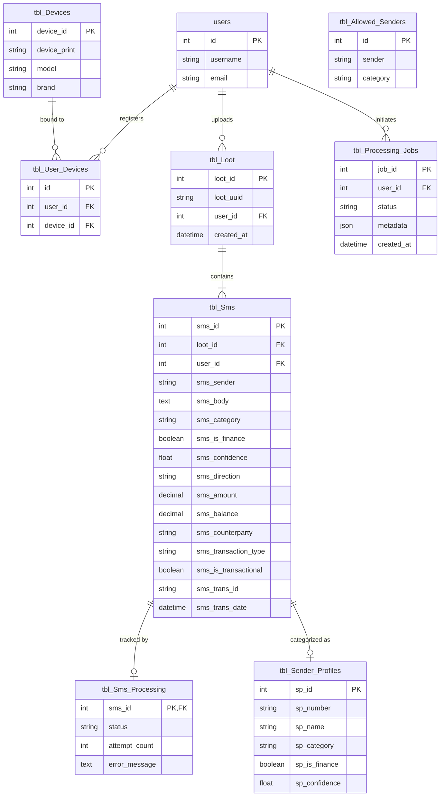

# Database Architecture & Schema Catalog — Mpesa Analyzer WebApp

This document details the database architecture, entity relationships, schema migrations, and table definitions for `db_mpesa_analyzer`.

---

## 1. Entity-Relationship Diagram (ERD)

The core relational structure and ingestion chain across users, devices, SMS payloads, and processing runs:



---

## 2. Schema Management & Migrations

Database tables are managed via CodeIgniter Spark migrations located in `app/Database/Migrations/`:

```bash
# Apply all pending migrations
php spark migrate --all

# Rollback last migration batch
php spark migrate:rollback

# Check migration status
php spark migrate:status
```

Operational rescan procedure: [docs/runbooks/full-rescan.md](../runbooks/full-rescan.md).

---

## 3. Table Catalog

| Table / View | Type | Purpose |
|--------------|:----:|---------|
| `tbl_Sms` | Table | **Canonical record** for all SMS. Holds raw body, ingest metadata, classification fields, and extracted transaction attributes. |
| `tbl_Loot` | Table | Metadata tracking each uploaded binary payload batch (`loot_*.enc`). |
| `tbl_Loot_Summary` | Table | Pre-calculated summary metrics per upload batch (total sent, received, fees). |
| `tbl_Devices` | Table | Registered Android device hardware fingerprints (15 build attributes). |
| `tbl_User_Devices` | Table | Association mapping between registered devices and user accounts. |
| `tbl_Analyzed_Transactions` | View | Derived read-only projection over `tbl_Sms` for transactional messages. |
| `tbl_Sms_Classification` | View | Derived read-only projection over `tbl_Sms` for category and finance mappings. |
| `tbl_Sms_Processing` | Table | Status tracker per SMS for ML processing (idempotency, attempt counts, errors). |
| `tbl_Processing_Jobs` | Table | Execution history for extraction jobs, including JSON metadata column. |
| `tbl_Sender_Profiles` | Table | Cached sender categorization results (phone number, category, confidence). |
| `tbl_Allowed_Senders` | Table | Global allowlist of pre-approved financial senders. |
| `tbl_Blocked_Senders` | Table | Per-user blocklist for excluded senders. |
| `tbl_ML_Controls` | Table | Admin system toggles (e.g. `auto_jobs_enabled`). |
| `tbl_LLM_Prompts` | Table | Versioned prompt overrides for LLM classification and extraction. |
| `tbl_Category_Rules` | Table | Custom regex keyword-to-category mapping rules defined by users. |
| `tbl_Budgets` | Table | User-defined periodic spending budgets and limit thresholds. |
| `tbl_Backups` | Table | Metadata catalog for automated and manual database backups. |
| `tbl_Chat_Messages` | Table | Persistent multi-turn conversations with AI Financial Assistant, tracking message text, client platform (`webapp`/`mobile`), device UA, and LLM latency. |
| `tbl_users` | Table | Legacy user account records for backward compatibility. |
| `auth_*`, `users` | Tables | CodeIgniter Shield tables managing identities, sessions, tokens, and RBAC groups. |
