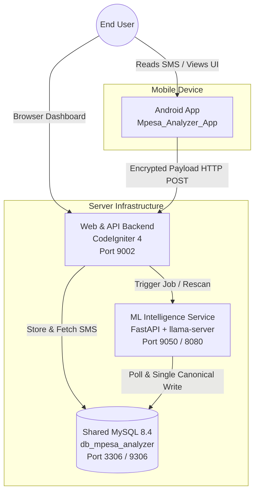

# System Architecture Overview

This document defines the C4 Context and Container boundaries for the **M-Pesa Analyzer** three-repository ecosystem.

---

## 1. High-Level Context

The system automates the ingestion, client-side encryption, server-side storage, and local AI enrichment of mobile money SMS notifications from Kenyan financial institutions (M-PESA, banks, SACCOs, fintechs).

---

## 2. Container Responsibilities & Technologies

| Container / Component | Repository | Runtime | Ownership & Role |
|-----------------------|------------|---------|------------------|
| **Android App** | `Mpesa_Analyzer_App` | Kotlin, Android SDK 35, Jetpack Compose | Captures local SMS, performs regex pre-classification, AES-128-CBC encrypts, and streams uploads to WebApp. |
| **Web & API Backend** | `Mpesa Analyzer WebApp` | PHP 8.3, Apache, CodeIgniter 4, Shield | Decrypts payloads, persists raw SMS in `tbl_Sms`, exposes dashboard UI, manages user accounts and budgets. |
| **ML Intelligence** | `ML Mpesa Analyzer` | Python 3.12, FastAPI, llama-server, Qwen2.5 1.5B | Autonomous background polling, known-sender dictionary lookup, LLM sender classification, and batch transaction extraction. |
| **Database** | Shared Container | MySQL 8.4 (InnoDB) | Central storage for raw SMS, classification profiles, transactions, and audit jobs. |

---

## 3. Trust Boundaries & Authentication

1. **Android Client $\to$ WebApp API**:
   - Authenticated via SHA-256 Access Tokens (`auth_identities` table managed by Shield).
   - Payloads are encrypted client-side using dynamic IV AES-128-CBC; backend decrypts via `openssl_decrypt()`.
2. **Browser $\to$ WebApp Dashboard**:
   - Session-cookie authenticated via CodeIgniter Shield.
   - Global CSRF token verification enabled on all mutating POST requests.
3. **WebApp $\to$ ML Service**:
   - Internal Docker network (`hosts-shared-network`) communication on `http://ml-mpesa-analyzer:9050`.
   - Admin management protected by WebApp session role filtering (`admin` filter).
4. **ML Service $\to$ MySQL**:
   - Direct connection via asynchronous SQLAlchemy engine (`aiomysql`).
   - Gated by admin control flag (`tbl_ML_Controls.auto_jobs_enabled`).
